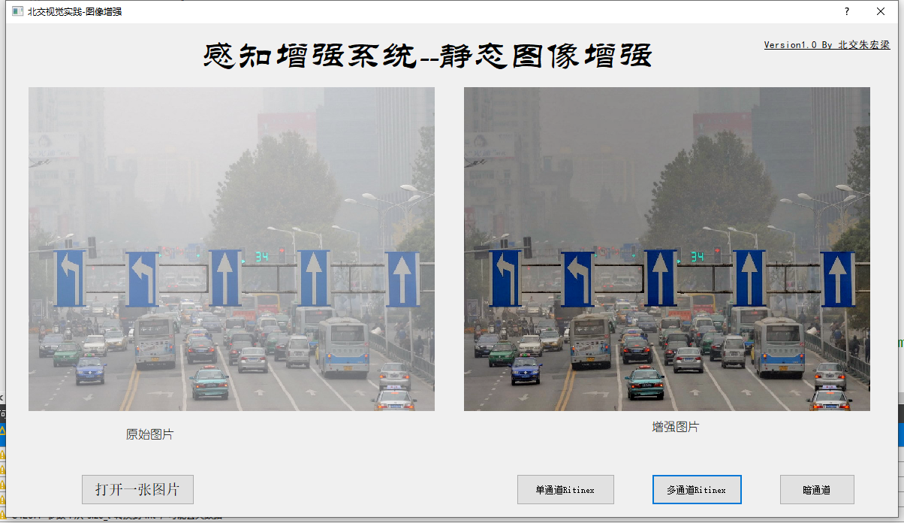
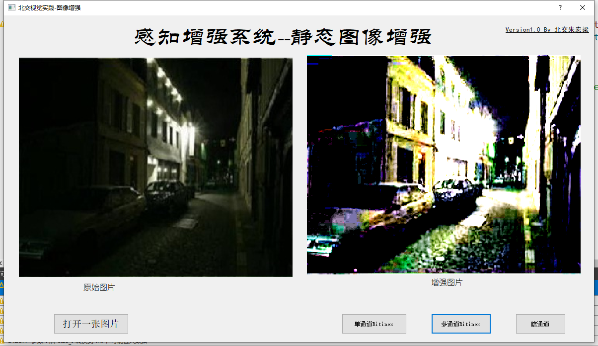

 # 北京交通大学研究生课程：2020春季机器视觉算法实践项目 

# 项目一：感知增强系统

设计感知增强系统，功能要求如下： 

a) 输入为静态图像，输出为增强后的图像。软件实现不良视觉条件下的视频增 强算法，在课程网站提供的 3 个图像数据集上（分别是雾天，特殊光照，不 均匀光照条件下的降质图像，也可以在自己采集的数据集上实验）进行测试。

b) 通过外设（摄像头）实时采集视频，实时增强，同时显示采集原始视频和增强视频。

开发平台和开发工具： 

1) 硬件平台：PC 或嵌入嵌入式系统；USB 接口的 Camera，其驱动程序为 OS 缺 省支持。 

2) OS：`Windows 10`

3) 开发工具：`QT5.12.8+OpenCV3.4.6`

## 图像增强界面效果：

## 视频增强：

Note： 图像路径不能是中文路径。

